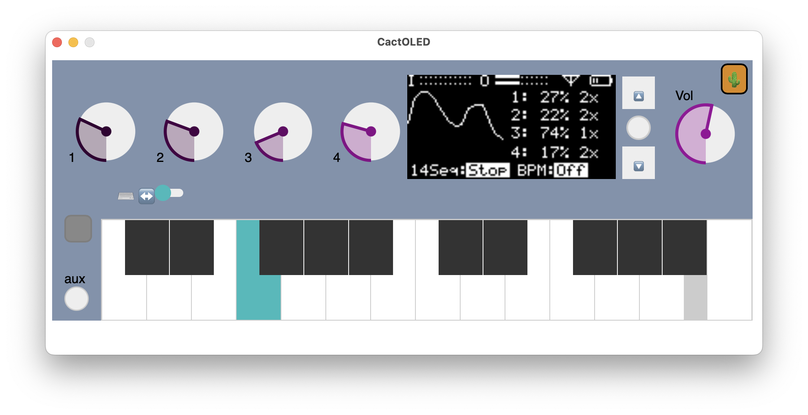

# A JS/Electron-Based OLED Emulator App for Organelle
This project contains a system of components for running [Organelle](https://www.critterandguitari.com/organelle) patches on a standard desktop/laptop operating system (I've tested it on macOS). 

### This project has 2 necessary components:

* A slightly modified version of the Organelle's `mother.pd` that provides the runtime environment needed by Organelle patches in PureData.
* An app (called `CactOLED`) that emulates the Organelle's OLED display. 
	* CactOLED is a standalone application that can talk to PureData by sending & receiving OSC messages over UDP. 

If you would prefer to run this simulator in a browser rather than as a standalone app, check out [https://github.com/samesimilar/cactos-py](https://github.com/samesimilar/cactos-py) which uses a Python bridge to send OSC messages between Pd and the browser.

## Installing

Currently there are two CactOLED macOS ("Darwin") builds in the `builds` folder. One is built for macOS on Apple Silicon (arm64) and the other for macOS on Intel (x64). Just download, unzip, and copy to your desired folder. 

You'll also need all four files in the `pd-mothermod` folder. Download them and keep them together in a folder somewhere convenient.

If you are experienced with building Electron apps, everything required to build CactOLED should be in this repository.

## Starting up

* Double-click the CactOLED app you downloaded. It will open up to the simulator and wait for a connection.
* Open `mother.pd` from the `pd-mothermod` folder in PureData. Probably you will need at least Pd v0.50.

Once both are open you can open your patch's `main.pd` (i.e. the entry point of your desired patch) so that it is running alongside `mother.pd`.
It can talk to CactOLED via the `[oscOut]` and `[oscIn]` objects in `mother.pd` (just like on the Organelle).

Tip: There are some clock and sequencer externals that I haven't included here but are commonly used on Organelle factory patches. You may find that some patches work, but the 'sequencer' function doesn't run.

Tip: Some patches may not work here if they depend on Pd externals that are built for Linux (ARM). The workaround is to build the externals from source for your preferred platform, or to find alternatives for their functionality. The 'Pd' message window will show the names of any objects that it cannot load.

## CactOLED Keyboard Shortcuts

* Left-shift: Aux key
* Enter: Presses main encoder button
* Up Arrow: Encoder counter-clockwise 
* Down Arrow: Encoder clockwise
* Keys asdf...: Piano keyboard keys
* Q: Toggle piano keyboard octave for shortcut keys (lower octave vs. higher octave)
* CMD+R: Reload the UI (like refreshing a browser) - good to try if the UI gets glitchy between loading patches.

Tip: Sometimes you have to twiddle the knobs (1-4) to get the Organelle patch to print to the screen.

Tip: Don't forget to turn up the volume!